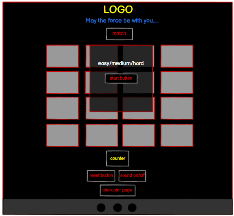
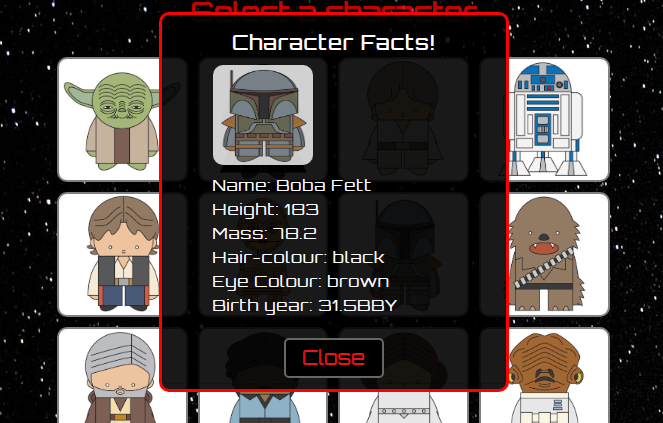
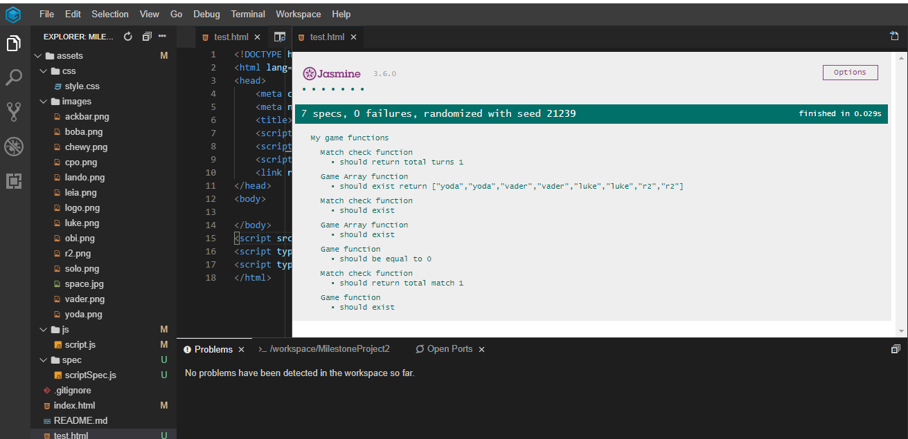
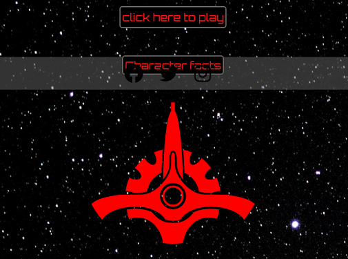
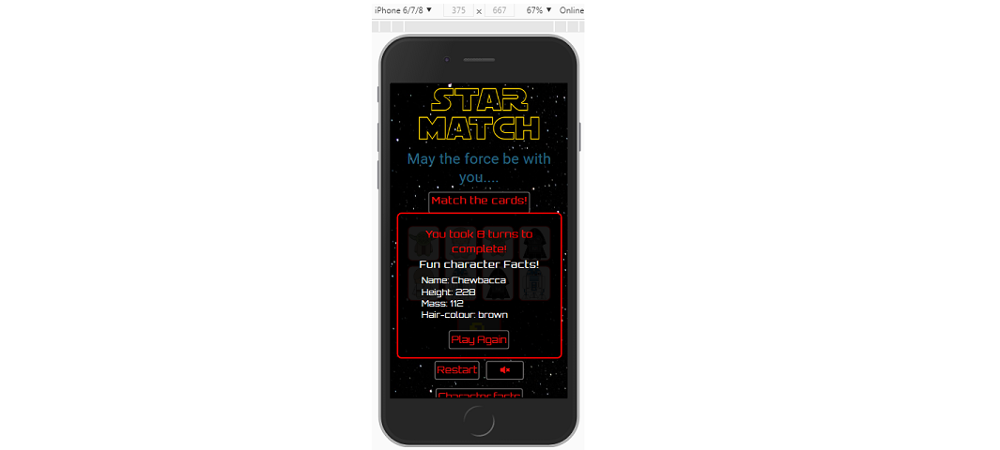
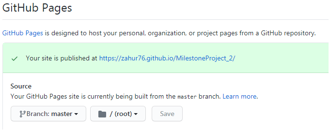
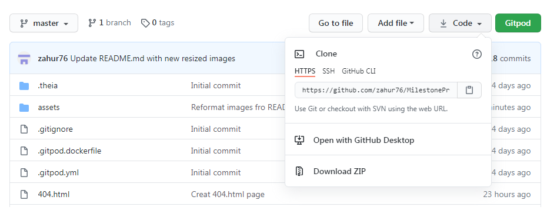

# **STAR MATCH**

## TABLE OF CONTENT 
* [Introduction](#introduction)    
* [UX](#ux)
    * [UX design work](#ux-design-work)
* [Development cycle](#development-cycle)
* [Features](#features)
    * [Grid sytem](#grid-system)
    * [Control buttons and counter](#control-buttons-and-counter)    
    * [Footer](#footer)
* [Technologies used](#technologies-used)
* [Javascript game logic](#javascript-game-logic)
* [Testing](#testing)
    * [UX testing](#ux-testing)
    * [validators](#validators)
    * [Chrome DevTools](#chrome-devtools)
    * [Jasmine unit testing](#jasmine-unit-testing)
    * [Game testing](#game-testing)
    * [Responsive design](#responsive-design)
    * [Button and link testing](#button-and-link-testing)    
    * [Issues encountered during development testing](#issues-encountered-during-development)

* [Deployment](#deployment)
* [Future improvments](#future-improvements)
* [Credits](#credits)

## INTRODUCTION 


This project is a Star Wars themed memory match game. The game was constructed with the intention of being a brain training tool 
to primarily strengthen memory. To differentiate from other memory match games a Star wars theme was incorporated.
Such a design would improve the overall user experience. 

This game also has the added benefit of being able to change difficulty levels with the intention of catering for different
user requirements. 

## UX 

By visiting this site as a user I want to:
* play a game to improve my congnitive function.  
* be able to navigate through the site with minimal difficulty inorder to play the game. 
* be provided with options so I can adapt to my personal preference. 
* have feedback on how well I am performing so as I can track any improvements in memory.
* play a brain traning game whilst having a fun experience.
* be exposed to general Star Wars character facts so I can further my Star wars knowledge.

### UX design work 

A wireframe was constructed using balsamique wireframes. It can be found  [here](assets/doc/wireframe.pdf).

The site was designed to change layout upon user input. This would allow the user to easily navigate 
through the initial game selection by being exposed to information required only at that specific time. 
For example, the level select modal would only appear once the "click to start' button had been activated, prompting 
the user for the next required input. This was done with intention of improving UX. To achieve this design philosophy 
modals were inlcuded. 

The character info section was included on a seperate page so as not to distract the user from the main game. It was designed
more as a secondary option for user to gain more knowledge about the characters in the main game. This would increase the overall
site experience. 

To further improve the UX the card grid system was initially hidden and would reveal itself in a way similar to the activation of a lightsaber. 
This effect was enhanced with audio. 

At design stage a initial colour scheme diagram was produced so as to suit the Star wars theme as shown below.



The Star wars themed design was achieved by using a logo and blue text similar to what is seen at the beginning of Star wars films. 
This was further enhanced by the use of a 'space' image background. 

All buttons were designed to be identical with grey border, red text and black background.  This was thought to fit into 
the Star wars sci-fy theme. The control buttons were situated together for user ease. 

The character facts link was placed at the bottom of the page since it was a secondary option and was not required to play the 
main game. 

The tiles were given a grey colour (rgb(105, 102, 102)) to provide good contrast to the background. 

The actually character cards were chosen to be of cartoon nature since this was thought to be more suited 
for a memory match game. Most importantly the character images were chosen so as to be as visually different as possible from each other
to prevent confusion while playing since this formed the main part of the game. 


## DEVELOPMENT CYCLE

The game initially started out as an idea to develop my javascript skills. Once the prototype was completed, it's concept 
was used as groundwork to develop this project. One of the advantages gained by doing this was the ability to code the game 
faster since the main game code logic had already been mapped out. 

The features were designed in the order that they would be selected while playing the game. For example the level select 
feature modal was coded before the main game. Once the initial main game design was completed then a preliminary testing 
performed as detailed [below](#testing). The development cycle main steps were as follows:

1. Game design work
2. Main game programming
3. Mid project review and testing
4. Character page programming
5. Programming for non-existent page
6. Final project review
7. Final testing

The full development cycle is detailed below:

1. [wireframe](assets/doc/wireframe.pdf) created
2. Index.html page created
3. Preliminary styling added to index.html page
4. Logo and slogan added to index.html page 
5. Footer added
6. Responsive design incorporated using boostrap
7. Javascript file script.js created
8. Level select modal added to index.html followed by coding of functions to show/hide modal and select levels in script.js
9. Functions required for main game logic coded (card selection, match check)
10. Game end modal contructed in index.html followed by the coding of functions to show/hide modal and play again
12. Functions for reset and restart buttons were coded
13. Perform Jasmine unit testing on functions to test for correct output 
14. Audio files added and sound on/off functions coded
15. Star wars API added
16. Mid project review performed for possible improvements in design and coding
17. Validators used to check for errors
18. Any issues from step 16 and 17 were addressed. Examples were refactoring of style.css to remove character property 
duplication and isssus due to responsiveness on smaller devices.
19. Game distributed to relatives and friends for testing
20. Character.html page created
21. Styling of character home page
22. Functions for character.html page coded (character modal selection, home button)
23. Star wars API included to character selection page
24. 404.html added page
25. Final project review
26. Adjustments made
27. Final testing performed


## FEATURES

The site consists of a two page design. The first page consists of the game which is made up of a logo, rules link, 
card grid system, control buttons, counter and footer. Two modals have also been included and described below.


The second page consists of card grid system which can be clicked to show character facts with a home button to return
back to game. 


### Grid system


The card grid system forms the main part of the site whereby the user can click on tiles to select a pair of cards for comparison.
The design also includes a hover effect to assist the user is knowing which card will be selected.

### Control buttons and counter


2 control buttons were included. The restart button permits the user to reset the game whilst the sound button
removes/adds sound effects.

A counter was included to provide the user with a running count of every turn made.

### Modals

Two modals were included for the main game. The first one permits the user to choose a difficulty level
which would change the size of card grid system. The second modal activated when the game was complete and contained:
* stats on the number of turns required to complete the game
* Star Wars character fact obtained from https://swapi.dev API 
* a button to play again.


A modal was included for the character facts section to show info on the clicked character.




### footer

A footer was added which incoporated social links to:
* official Star Wars facebook site
* official Star Wars twitter site
* official Star Wars Istagram site

## TECHNOLOGIES USED

* HTML5
* css 
* javacript (ES6)
* Jquery to simplify DOM manipulation
* official W3C validator to check HTML syntax
* css official validator(jigsaw) to check css syntax
* JSHint to check javacript syntax 
* Jasmine testing framework for unit testing
* Chrome developers tools for analysing scripts and debugging
* Bootstrap 4 for page layout purposes and responsive design aspects
* balsamiq wireframes application to create the site design
* Chrome extension 'responsive viewer' to aid in reponsive design 

## JAVASCRIPT GAME LOGIC

The code logic behind the main game was as follow:
* Determine grid size my selecting difficulty level which would hide or expose div elements which specific classes.
* Provide the attribute of '.card' and '.character' (e.g ".yoda") to the class of all card elements using a for loop for the
'.character' class.
The '.card' class would be situated below '.character' class in css to make it the dominant class.
* Select two cards. 
* For each card selected the class attribute of '.card' would be removed using removeClass method, which would expose the '.character' class.
* A Comparison of the remaining class attribute of the two selected cards is then performed.
* If the remaining class attribute for two cards are the same then the off click method (.off("click")) would be applied and match count increased by 1.
* If the remaining class attribute are not the same the class attribute of ".card" would be added back which would hide the character class.
* sequence continues until all '.character' classes are exposed which is identified by using match count and grid size. 


## TESTING 

This section provides details of testing performed during development. Testing were carried during different phases of develpment as 
indicated below:

| Test                | Stage Performed                                  | Tool used                                     |
|---------------------|:-------------------------------------------------|:----------------------------------------------|
|Syntax errors        |Once During mid development and on completion     |W3C validator, css validator(jigsaw), jshint   |
|Debugging            |During the whole project                          |Chrome Devtools                                |
|Reponsive design     |During the whole project                          |Chrome Devtools and reposnsive viewer extension|
|Unit testing         |One check when main game functions were completed |Jasmine Framework                              |
|User game testing    |Once Main game module was complete until the end  |n/a                                            |
|Browser compatibility|On project completion                             |Real testing on browsers and parrotqa.com      |                    
|Button/link testing  |During development and project completion         |Manual testing                                 |


### UX testing

The goals set out in the UX section were accomplished as follows:

1. User goal: *play a game to improve my congnitive function*<br>
Although difficult to measure, memory match games have scientifically been shown to be an effective brain training tool, especially
improving:
* concentration
* shorterm memory
* attention to detail 
* finding similarities and differences in objects

2. User goal: *be able to navigate through the site with minimal difficulty inorder to play the game.*</br>
The site design used straight forward user friendly step-by-step guides to help assist the player navigate
the options with ease. This was further achieved by the use of hide/show jquery methods which manipulated modals and text changes.
For example once the user selected "click here to play' the grid system would appear together with a 
modal allowing the user to select difficulty level. Also the text "click here to play" changes to "match the cards" indicating that the game has started.
This was further tested by allowing test users to play the game with minimum prompting.

3. User goal: *be provided with options so I can adapt to my personal preference.*</br>
This was primarily achieved by providing a [level select](#modals) option which would change the card grid size. This would permit 
the user to change difficulty level depending on his requirements. For example the user could select easy hard because he wanted more of a challenge.
Another option included to achieve this user goal was the [sound on/off](#control-buttons-and-counter) button.

4. User goal: *have feedback on how well i am performing so as I can track any improvements in memory*</br>
This was achieved by using a [counter](#control-buttons-and-counter) indicating how many turns have been taken which can be used as a
baseline for future game attempts.

5. User goal: *play a brain traning game whilst having a fun experience*</br>
This was achieved by using Star Wars themed design which made the game more visually appealing.

6. User goal: *be exposed to general Star Wars character facts so I can further my star wars knowledge*</br>
This was achieved by consuming a Star Wars API provided by [swapi.dev](https://swapi.dev). This would provide a random character
fact highlighting the characters name, height, weight, and hair-clour when the game finished. A second page
also allowed the user to click on specific Star wars characters to obtain facts.
These features are described [above](#modals).

The above user goals were further tested by obtaining feedback from testers. The feedback was positive all on aspects.

### Validators

Code syntax were checked for errors with the following validators:
* official W3C validator located [here](https://validator.w3.org/)
* css official validator(jigsaw) located [here](https://jigsaw.w3.org/css-validator/)
* JSHint located [here](https://jshint.com/)


Errors were corrected and final test results are given below:

| Test                           | Expected result              | Results            |                                 
|:-------------------------------|:-----------------------------|:-------------------|
|W3C validator                   |No errors found               |Passed              |
|css official validator(jigsaw)  |No errors or warnings to show |Passed              |                            
|JSHint located                  |No warnings                   |Warnings present    |


The Jshint test warning " 'let' is available in ES6 (use 'esversion: 6') or Mozilla JS extensions (use moz)." was due to
syntax used for defining variables.

### Chrome DevTools

Chrome DevTools were used extensively during development phase to assist in:
* page layout issues 
* checking errors
* debugging
* verifying correct output using console  

### Jasmine unit testing

Once the main game functions were completed Jasmine framework was used to ensure functions were defined and output were correct. 
Tests were successful as detailed below. 
The scriptSpec.js file is located in the spec folder.

| Test                           | Expected result                                     | Results  |                                 
|:-------------------------------|:----------------------------------------------------|:---------|
|expect(gameArray).toBeDefined() |Should exist                                         |Passed    |
|gameArray("easy")               |"yoda","yoda","vader","vader","luke","luke","r2","r2"|Passed    |                            
|expect(matchCheck).toBeDefined()|Should exist                                         |Passed    |
|matchCheck(["yoda","yoda"])     |should return total turns 1                          |Passed    |
|matchCheck(["yoda","yoda"])     |should return total match 1                          |Passed    |
|expect(game).toBeDefined()      |Should exist"                                        |Passed    |
|expect(click).toBe(0)           |should be equal to 0                                 |Passed    |




### Game testing

The game was tested with friends and relatives to check for bugs and to obtain feedback. This was performed when main game 
module was complete upto project completion. The game was tested for game logic errors and design improvements. 

Issues encountered and rectified are given [below](#issues-encountered-during-development)

### Responsive design

The site was viewed on different device sizes to check for correct reponsive design. This was done using primarily
Chrome DevTools with different emulated devices(moto G4, iphone 6/7/8, ipad, ipad pro). The reponsive viewer chrome 
extension was also used together with physical testing on smart phones, tablets and desktop computers. 


A final check was done using the website http://ami.responsivedesign.is/. 

Issues encountered and rectified are given [below](#issues-encountered-during-development)

### Browser compatibility

The site was also tested on Google Chrome, FireFox, Internet Explorer, Safari and Opera by running the game on these browsers.
A cross browser check was also done using the website https://www.parrotqa.com catering for chrome, safari and FireFox.


Issues encountered and rectified are given [below](#issues-encountered-during-development)

### Button and link testing

The following gives test results for button and link testing.

|Page            | Action taken                           |Expected result                                          | Results |                                 
|:---------------|----------------------------------------|:--------------------------------------------------------|:--------|
|index.html      |click on "click here to play"           |Card grid system and level select modal to appear        |Passed   |
|index.html      |click on "play" with no level selected  |"Choose you difficulty level" to flash                   |Passed   |                           
|index.html      |click on "play" with level selected     |level modal game to disappear                            |Passed   |
|index.html      |click on card                           |star wars character to appear                            |Passed   |
|index.html      |click on restart button                 |level modal to appear                                    |Passed   |
|index.html      |click on sound button                   |sound icon to change and audio to off                    |Passed   |
|index.html      |click on facebook icon                  |Facebook star wars page to open up in new window         |Passed   |                     
|index.html      |click on twitter icon                   |Twitter star wars page to open up in new window          |Passed   |         
|index.html      |click on Insagram icon                  |Instagram star wars page to open up in new window        |Passed   |  
|character.html  |click on home button                    |Return back to index.html page                           |Passed   |
|character.html  |click on card                           |character  modal to appear with image and facts          |Passed   |                           
|character.html  |click on modal close button             |Character facts modal game to disappear                  |Passed   |
|character.html  |click on facebook icon                  |Facebook star wars page to open up in new window         |Passed   |                     
|character.html  |click on twitter icon                   |Twitter star wars page to open up in new window          |Passed   |         
|character.html  |click on Insagram icon                  |Instagram star wars page to open up in new window        |Passed   |
|index.html      |click on non-existent link              |Direct to 404.html page                                  |Passed   |
|index.html      |click on rules link                     |Direct to wikepedia page                                 |Passed   |

### Issues Encountered during development

During testing phase the following issues were indentified and corrected.

1. Once a specific card was exposed it could be selected again causing the card game logic to breakdown. This was 
resolved by adding the condition ```(($(this).attr("class")).length)>=6)``` in the click function. 

2. The Star Wars character funfact at the end of the game would not show up if a status other than 200 was obtained.
To cater for this issue a defensive design was implemented by including an else if statement in the getData function so that if a status other than 200 was obtained
a default character fact would appear. Character chosen was Luke Skywalker. This was further tested by providing an incorrect URL to the getdata function 
and checking the output.</br>
In the case of character facts on the character-info.html page 'data unavailable' would appear in the fields. 


3. On the level select modal the play button could be pressed without a level being selected. To fix this bug
a condition was added, ```if($("input[type=radio][name=level]:checked").length===1)```, to activate the play button only when a level was selected and the "choose your difficulty level" text 
was made to blink so as to prompt the user.

4. After completing the game and pressing the restart button, two modals would superimpose on each other. This bug was fixed
by hiding the 'gameEnd' module if the restart button is pressed.

5. Each star wars character had its own character class which produced alot of repetition for only a change in image URL. To avoid having
to repeat each character class, consuming large amount of css lines, a solution was found whereby the background-image URL was added 
with Javacsript once the card was selected. This provided a more efficient style sheet.

6. Once the main game was completed and testing peformed it was noticed that the play again button was hidden on the game end modal.
This was adjusted by increasing modal height from 270px to 310px.


7. When the game was completed and the fun facts would appear it would briefly show the previous character info. This issue
was addressed by adding a loading bar gif when ever the fun facts function was called and no repsonse from the API had been obtained yet.

8. While checking for browser compatibility it was found that the footer was not fixed to the bottom on IE browser. This issues was corrected 
by changing ```flex: 1``` to ```flex-grow: 1```.


9. While testing for reponsiveness using chrome dev tools it was noticed that the text below logo would change lines on smaller devices.
This issue was addressed by changing font size.


10. After final project review it was decided to add instructions on how to play the game. This was achieved by adding a rules tag 
to the header which linked to a wikepdia [page](https://en.wikipedia.org/wiki/Matching_game) containing the relevant information. 

## DEPLOYMENT

Gitpod was used as an online IDE and then pushed to GITHUB for [hosting](https://zahur76.github.io/MilestoneProject_2/).

To deploy the project on github pages the following steps were used:
1. Login to Github and select the the MilestoneProject_2 repository.
2. Press the setting button on the top menu bar located on the right-hand side.


3. Scroll down to the Github pages section and select Master branch from the dropdown menu and press save.


4. Once completed an active link is published for the repository. 

To run code locally the following steps should be performed:
1. On GitHub, navigate to the main page of the repository.
2. Above the list of files, click  Code and copy URL.


3. Open Git Bash.
4. Change the current working directory to the location where you want the cloned directory.
5. Type git clone, and then paste the URL you copied earlier.</br>
    $ git clone https://github.com/zahur76/MilestoneProject_2
6. Press Enter to create your local clone.

## FUTURE IMPROVEMENTS

Add a countdown timer option to add another level of difficulty to the game. The user would be able to specify both
a difficulty level and a time limit inorder to complete the game.

## CREDITS

### Content

* Star Wars character facts obtained from open source API provided by https://swapi.dev/.
* dev.to was consulted to assist in footer [placement](https://dev.to/amjadmh73/the-best-way-to-keep-the-footer-at-the-bottom-of-your-web-page-32ek).

### Media

* Google font from which the following fonts were used:
    - Roboto
    - Orbitron 
    - Press Start 2P
* Sound clips were obtained from https://www.101soundboards.com/.
* Card images were purchased from mintParcel.com.
* Logo obtained from https://flamingtext.com/.
* Icons for home, social media and galactic senate were obtained from fontawesome.com.
* Loading gif was obtained from icons8.com.

### Acknowledgment

* I would like to thank zara meerun, sofia meerun and behlal meerun for testing the game and also my mentor 
Allen Thomas Varghese for his input during the mentor sessions.


