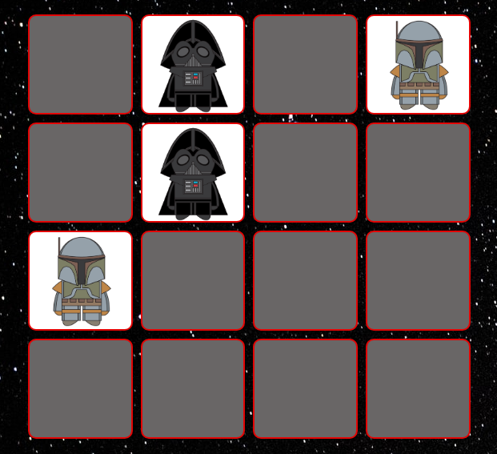
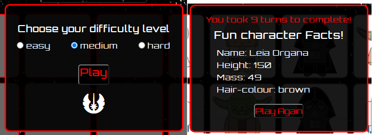
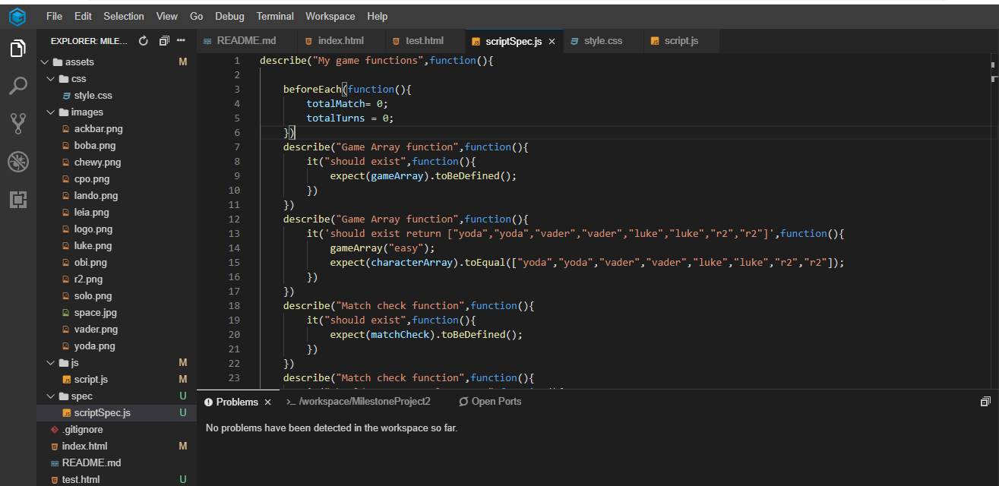
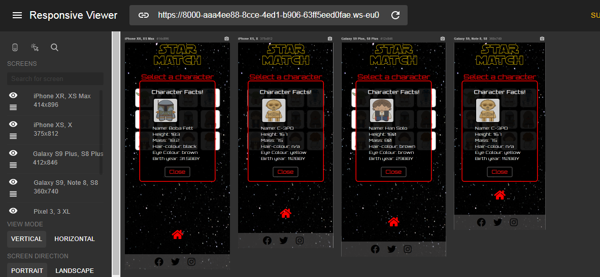
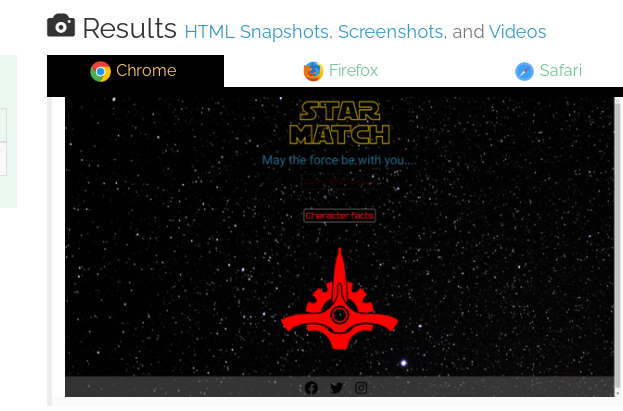
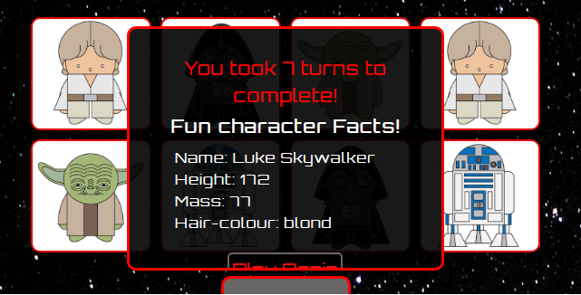

# **STAR MATCH**

## TABLE OF CONTENT 
* [Introduction](#introduction)    
* [UX](#ux)
    * [UX design philosophy](#ux-design-philosophy)
* [Development cycle](#development-cycle)
* [Features](#features)
    * [Grid sytem](#grid-system)
    * [Control buttons and counter](#control-buttons-and-counter)    
    * [Footer](#footer)
* [Technologies used](#technologies-used)
* [Javascript game logic](#javascript-game-logic)
* [Testing](#testing)
    * [UX testing](#ux-testing)
    * [validators](#validators)
    * [Chrome DevTools](#chrome-devtools)
    * [Jasmine unit testing](#jasmine-unit-testing)
    * [Game testing](#game-testing)
    * [Responsive design](#responsive-design)
    * [Button and link testing](#button-and-link-testing)
    * [Summary of test results](#summary-of-test-results)
    * [Bugs encountered during development testing](#bugs-encountered-during-development)

* [Deployment](#deployment)
* [Future improvments](#future-improvements)
* [Credits](#credits)

## INTRODUCTION 


This project is a Star Wars themed memory match game. The game was constructed with the intention of being a brain training tool 
to primarily strengthen memory. Instead of making a straight forward memory match game a Star wars theme was incorporated.
Such as design would improve the overall training experience and make it more enjoyable.

This game also has the added benefit of being able to change difficulty levels with the intention of adding catering for different
user requirements. 

## UX 

By visiting this site as a user I want to:
* play a game to improve my congnitive function.  
* be able to navigate through the site with minimal difficulty to start playing the game with ease. 
* be able to select different difficulty levels so I can adapt to my personal goals. 
* have feedback on how well i am performing so as I can track any improvements in memory.
* play a brain traning game whilst having a fun experience.
* be exposed to general Star Wars character facts so I can further my Star wars knowledge.


### UX design philosophy 

A wireframe was constructed using balsamique wireframes. It can be found  [here](assets/doc/wireframe.pdf).

The site was designed to be minimalist by changing page configuration upon user input. This would allow the user to easily navigate 
through the initial game selection by being exposed to information required only at the time. 
For example the grid system and control buttons would only appear once the "click to start' button had been clicked on. This was 
done with intention of improving UX. Modals were also used included as this was thought to be more intuitive for the user
and would prevent information overload. 
The character info section was include on a seperate page so as not to distract the user from the main game.

## DEVELOPMENT CYCLE

The game initially started out as an idea to develop my javascript skills. Once the prototype was completed, it's concept 
was used as groundwork to develop this project. One of the advantages gained by doing this was the ability to code the game 
faster since the main game code logic had already been designed. The development cycle was as follows:

1. Create [wireframe](assets/doc/wireframe.pdf)
2. Create Index.html page
3. Add preliminary styling to index.html page
4. Add logo and slogan 
5. Add footer
6. Add responsive design using boostrap
7. Create javascript file
8. Create level select modal in html followed by the required functions in script.js
9. Code functions required for main game logic (card selection, match check)
10. Create game end modal in index.html followed by the required functions in script.js
11. Code functions required for restart and replay buttons
12. Perform Jasmine unit testing on functions 
13. Add audio files and add sound on/off functions
14. Add Star wars API
15. Code reviewed for possible improvements 
16. Validators used to check for errors
17. Any issues from step 15 and 16 were addressed
18. Game given to relatives and friends for testing
19. Character.html page created
20. Design functions for character.html page
21. Add 404.html page
22. Final testing 

The items were coded in the order that they would be selected while playing the game.
The initial main game design was completed then a preliminary testing performed as detailed [below](#testing). 

## FEATURES

The site consists of a two page design. The first page consists of the game which is made up of a logo, 
card grid system, control buttons, counter and footer. Two modals have also been included and described below.


The second page consists of card grid system which can be clicked to show character facts with a home button to return
back to game. 


### Grid system



The card grid system forms the main part of the site whereby the user can select a pair of cards for comparison.
The design also includes a hover effect to assist the user is knowing which card will be selected.

### Control buttons and counter


2 control buttons were included. The restart button permits the user to reset the game whilst the sound button
removes/adds sound effects.

A counter was included to provide the user with a running count of every turn made.

### Modals

Two modals were included for the main game. The first one permits the user to choose a difficulty level
which would change the size of card grid system. The second modal activated when the game was complete and contained:
* stats on the number of turns required to complete the game
* Star Wars character fact obtained from https://swapi.dev API 
* a button to play again.



A modal was included for the character facts section to show info on the clicked character.


### footer

A footer was added which incoporated social links to:
* official Star Wars facebook site
* official Star Wars twitter site
* official Star Wars Istagram site

## JAVASCRIPT GAME LOGIC

The code logic behind the main game was as follow:
* Determine grid size my selecting difficulty level which would hide or expose div elements which specific classes.
* Provide the attribute of '.card' and '.character' (e.g ".yoda") to the class of all card elements using a for loop for the
'.character' class.
The '.card' class would be situated below '.character' class in css to make it the dominant class.
* Select two cards. 
* For each card selected the class attribute of '.card' would be removed using removeClass method, which would expose the '.character' class.
* A Comparison of the remaining class attribute of the two selected cards is then performed.
* If the remaining class attribute for two cards are the same then the off click method (.off("click")) would be applied and match count increased by 1.
* If the remaining class attribute are not the same the class attribute of ".card" would be added back which would hide the character class.
* sequence continues until all '.character' classes are exposed which is identified by using match count and grid size. 


## TESTING 

This section provides details of testing performed during development. Testing were carried during different phases of develpment as 
indicated below:

| Tests               | Stage Performed                                  | Tool used                                     |
|---------------------|:-------------------------------------------------|:----------------------------------------------|
|Syntax errors        |Once During mid development and on completion     |W3C validator, css validator(jigsaw), jshint   |
|Debugging            |During the whole project                          |Chrome Devtools                                |
|Reponsive design     |During the whole project                          |Chrome Devtools and reposnsive viewer extension|
|Unit testing         |One check when main game functions were completed |Jasmine Framework                              |
|User game testing    |Once Main game module was complete until the end  |n/a                                            |
|Browser compatibility|On project completion                             |Real testing on browsers and parrotqa.com      |                    
|Button/link testing  |During development and project completion         |Manual testing                                 |


### UX testing

The goals set out in the UX section were accomplished as follows:

1. User goal: *play a game to improve my congnitive function*<br>
Although difficult to measure, memory match games have scientifically been shown to be an effective brain training tool, especially
improving:
* concentration
* shorterm memory
* attention to detail 
* finding similarities and differences in objects

2. User goal: *be able to navigate through the site with minimal difficulty to start playing the game with ease.*</br>
The site design used straight forward user friendly step-by-step guides to help assist the player navigate
the options with ease. This was further achieved by the use of hide/show jquery methods which manipulated modals and text changes.
For example once the user selected "click here to play' the grid system would appear together with a 
modal allowing the user to select difficulty level. Also the text "click here to play" changes to "match the cards" indicating that the game has started.
This was further tested by allowing test users to play the game with minimum prompting.

3. User goal: *be able to select different difficulty levels so I can adapt to my personal goals*</br>
This was primarily achieved by providing a level select option which would change the card grid size and hence difficulty.
Hence the user could change difficulty depending on his his what he wanted to achive. For example he could select easy level 
because he was new to the game.

4. User goal: *have feedback on how well i am performing so as I can track any improvements in memory*</br>
This was achieved by using a counter indicating how many turns have been taken which can be used as a
baseline for future game attempts.

5. User goal: *play a brain traning game whilst having a fun experience*</br>
This was achieved by using Star Wars themed design which made the game more visually appealing.

6. User goal: *be exposed to general Star Wars character facts so I can further my star wars knowledge*</br>
This was achieved by consuming a Star Wars API provided by [swapi.dev](https://swapi.dev). This would provide a random character
fact highlighting the characters name, height, weight, and hair-clour when the game finished. A second page
was also included during delvelopment which allowed the user to click on specific Star wars characters to obtain facts.

The above user goals were further tested by obtaining feedback from testers. The feedback was positive all on aspects.

### Validators

Code syntax were checked for errors with the following validators:
* official W3C validator located [here](https://validator.w3.org/)
* css official validator(jigsaw) located [here](https://jigsaw.w3.org/css-validator/)
* JSHint located [here](https://jshint.com/)


| Tests                          | Expected result              | Results            |                                 
|:-------------------------------|:-----------------------------|:-------------------|
|W3C validator                   |No errors found               |Passed              |
|css official validator(jigsaw)  |No errors or warnings to show |Passed              |                            
|JSHint located                  |No warnings                   |Warnings present    |

The Jshint test warning " 'let' is available in ES6 (use 'esversion: 6') or Mozilla JS extensions (use moz)." was due to
syntax used for defining variables.

### Chrome DevTools

Chrome DevTools were used extensively during development phase to assist in:
* page layout issues 
* checking errors
* debugging
* verifying correct output using console  

### Jasmine unit testing

Once the main game functions were completed Jasmine framework was used to ensure functions were defined and output were correct. 
Tests were successful as detailed below. 
The scriptSpec.js file is located in the spec folder.

| Test                           | Expected result                                     | Results  |                                 
|:-------------------------------|:----------------------------------------------------|:---------|
|expect(gameArray).toBeDefined() |Should exist                                         |Passed    |
|gameArray("easy")               |yoda","yoda","vader","vader","luke","luke","r2","r2" |Passed    |                            
|expect(matchCheck).toBeDefined()|Should exist                                         |Passed    |
|matchCheck(["yoda","yoda"])     |should return total turns 1                          |Passed    |
|matchCheck(["yoda","yoda"])     |should return total match 1                          |Passed    |
|expect(game).toBeDefined()      |Should exist"                                        |Passed    |
|expect(click).toBe(0)           |should be equal to 0"                                |Passed    |




### Game testing

The game was tested with friends and relatives to check for bugs and to obtain feedback. This was performed when main game 
module was complete upto project completion. The game was mainly tested for bugs related to game logic. 

### Responsive design

The site was viewed on different device sizes to check for correct reponsive design. This was done using primarily
Chrome DevTools with different emulated devices(moto G4, iphone 6/7/8, ipad, ipad pro). The reponsive viewer chrome 
extension was also used together with physical testing on smart phones, tablets and desktop computers. 



A final check was done using the website http://ami.responsivedesign.is/. 


### Browser compatibility

The site was also tested on Google Chrome, FireFox, Internet Explorer, Safari and Opera by running the game on these browsers.
A cross browser check was also done using the website parrotqa.com catering for chrome, safari and FireFox.



### Button and link testing

The following gives test results for button and link testing.

|Page            | Action taken                           |Expected result                                          | Results |                                 
|:---------------|----------------------------------------|:--------------------------------------------------------|:--------|
|index.html      |click on "click here to play"           |Card grid system and level select modal to appear        |Passed   |
|index.html      |click on "play" with no level selected  |"Choose you difficulty level" to flash                   |Passed   |                           
|index.html      |click on "play" with level selected     |level modal game to disappear                            |Passed   |
|index.html      |click on card                           |star wars character to appear                            |Passed   |
|index.html      |click on restart button                 |level modal to appear                                    |Passed   |
|index.html      |click on sound button                   |sound icon to change and audio to off                    |Passed   |
|index.html      |click on facebook icon                  |Facebook star wars page to open up in new window         |Passed   |                     
|index.html      |click on twitter icon                   |Twitter star wars page to open up in new window          |Passed   |         
|index.html      |click on Insagram icon                  |Instagram star wars page to open up in new window        |Passed   |  
|character.html  |click on home button                    |Return back to index.html page                           |Passed   |
|character.html  |click on card                           |character  modal to appear with image and facts          |Passed   |                           
|character.html  |click on modal close button             |Character facts modal game to disappear                  |Passed   |
|character.html  |click on facebook icon                  |Facebook star wars page to open up in new window         |Passed   |                     
|character.html  |click on twitter icon                   |Twitter star wars page to open up in new window          |Passed   |         
|character.html  |click on Insagram icon                  |Instagram star wars page to open up in new window        |Passed   |
  
### Bugs Encountered during development

During testing phase the following main errors were indentified and corrected.

1. Once a specific card was clicked it could be selected again causing the card game logic to breakdown. This was 
resolved by adding the condition ```(($(this).attr("class")).length)>=6)``` in the click function.

2. The Star Wars character funfact at the end of the game would not show up if a status other than 200 was obtained.
To cater for this issue a defensive design was implemented by including an else if statement in the getData function so that if a status other than 200 was obtained
a default character fact would appear. Character chosen was Luke Skywalker. This was further tested by providing an incorrect URL to the getdata function 
and checking the output.</br>
In the case of character facts on the character-info.html page 'data unavailable' would appear in the fields. 


3. On the level select modal the play button could be pressed without a level being selected. To fix this bug
a condition was added, ```if($("input[type=radio][name=level]:checked").length===1)```, to activate the play button only when a level was selected and the "choose your difficulty level" text 
was made to blink so as to prompt the user.

4. After completing the game and pressing the restart button, two modals would superimpose on each other. This bug was fixed
by hiding the 'gameEnd' module if the restart button is pressed.

5. Each star wars character had its own character class which produced alot of repetition for only a change in image URL. To avoid having
to repeat each character class, consuming large amount of css lines, a solution was found whereby the background-image URL was added 
with Javacsript once the card was selected. This provided a more efficient style sheet.

6. Once the main game was completed and testing peform it was noticed that the play again button was hidden on the game end modal.
This was adjusted by increasing modal height from 270px to 310px.



7. When the game was completed and the fun facts would appear it would briefly show the previous character info. This issue
was addressed by adding a loading bar gif when ever the fun facts function was called and no repsonse from the API had been obtained.


